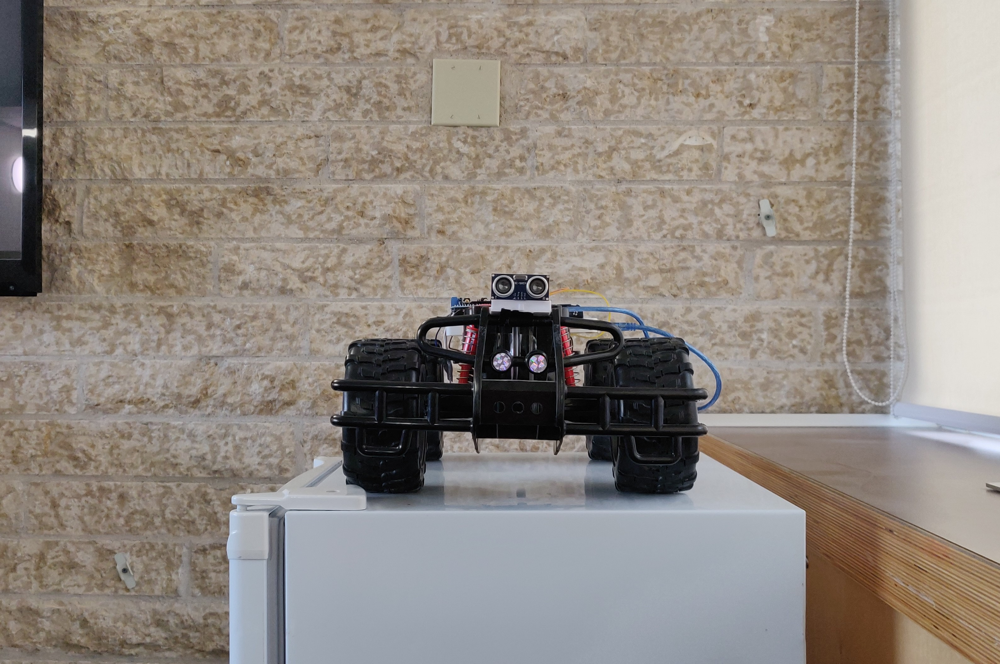
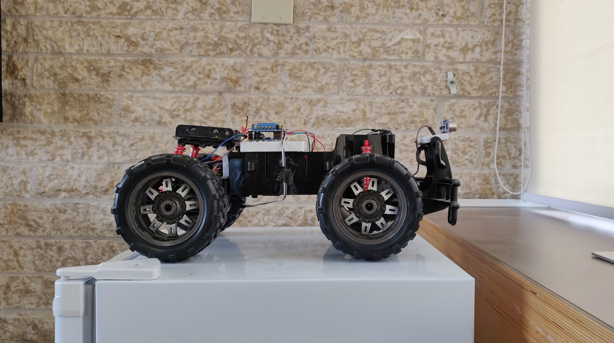
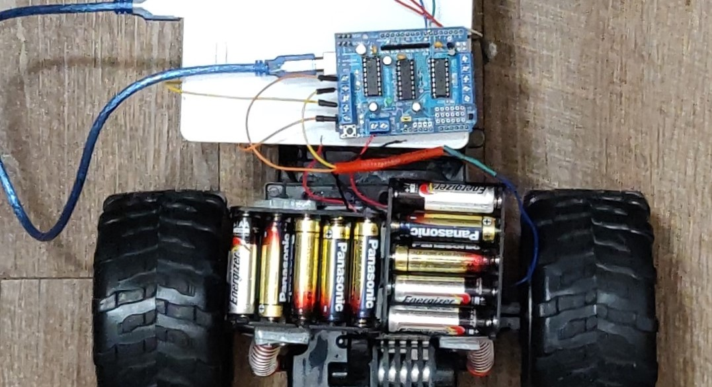
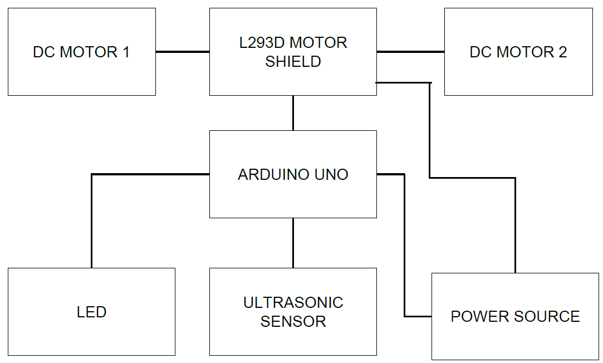

# Autonomous-RC-Car
In this project, the old radio-controlled car will be made autonomous by adding an ultrasonic sensor to it. This ultrasonic sensor helps in avoiding obstacles in front of the car by emitting ultrasonic sound waves. This autonomous car detects the obstacle and avoids collision by changing its direction of movement. The ultrasonic sensor sends the data to the Arduino micro-controller and then the micro-controller with the help of a motor-shield controls the movements of the wheels via DC motors<h2>The front view of my RC car</h2>

<h2> The side view of my RC car</h2>
 
 <h2> The motor-shield along with the batteries</h2>
  

 # Build Instructions
 
 The breadboard view gives you a strong clarity of how different components are connected together, by looking at this you can aslo build similar design for your project.
 

There is no need to solder any wire or component. Motor-shield comprises screws which need to be tightened after connecting the wires. But we must be careful that all the pins of the motor-shield must coincide with that of the Arduino pins, else the motor-shield would be burnt or doesn’t function properly
# Repository Contents
__Here's where you'll provide a map of all the top-level contents (where applicable):__
1. __/Images__ - This is where you can see all the coding stuff (.ino).
2. __/Modules__ - This is where the image files for this readme are..
3. __/src__ - This is the place where the code is divided into segments, for better understanding.
4. __/README.md__ - This is the file you're reading now! :-D

# Block Diagram

Here is the block diagram of this project which depicts all the components connected together. With the help of this the user can understand the connection of the components.

 

# Requirements and Materials
<h4> Libraries required for the project are </h4>
 <b>1. ADAFRUIT MOTOR-SHIELD LIBRARY</b> : (https://github.com/adafruit/Adafruit-Motor-Shield-library/zipball/master)
This is the best library when it comes to operating DC motors via motor-shield.
<h4> The materials required for this project are as follows.</h2>

1. 1 x RC Car
2. 1 x Ultrasonic Sensor.
3. 1 x Arduino UNO
4. 1 x Ada-fruit Motor Shield L239D. 
5. 3 x LED for the brake lights.
6. 2 x Battery holders.
7. 2 x Bread board for placement of Arduino Uno and Ultrasonic sensor.
8  3 x 100k resistor
9. 10 x AA batteries (10 Volts).

# Installing Arduino Software

1. You can download the IDE from here : (https://www.arduino.cc/en/main/software).

2. After you install the IDE click here to learn more about it : (https://www.arduino.cc/en/Guide/HomePage).

# Usage

1. Upload the code to the Arduino.
2. Power both the Arduino and the Motor-shield via batteries.
3. Then the car moves to the front automatically, it then stops if it finds an obstacle, and then goes back for a bit, and then turns to the left and again checks for the obstacle, otherwise, it turns to the right this time and further continues to go in the same       direction.
4. This would be cool to watch because it automatically does all these things by itself.
5. Last, don’t forget to remove the batteries from the battery holder, sometimes both the Arduino and the Motor-Shield can become really hot after an immense usage.

# Contributors
1. <b>Tanu Nanda Prabhu</b> - I did everything. I am the only contributor for this project, I am fascinated about cars, also I am a car freak, Hence I chose this project which makes me happy. Contact me at @ tanuprabhu96@gmail.com

# Credits
1. Trevor Michael Tomesh: consultation on directory structure

