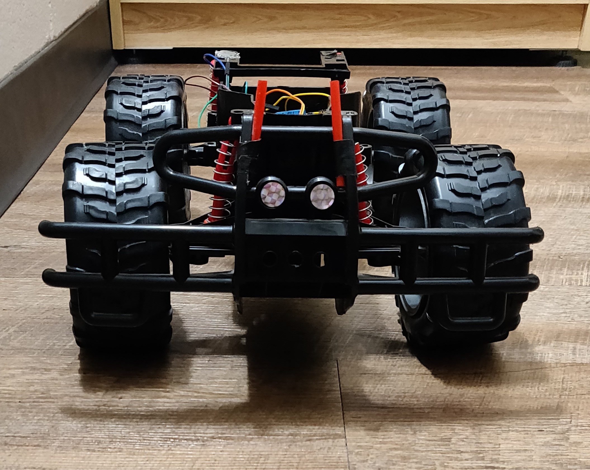
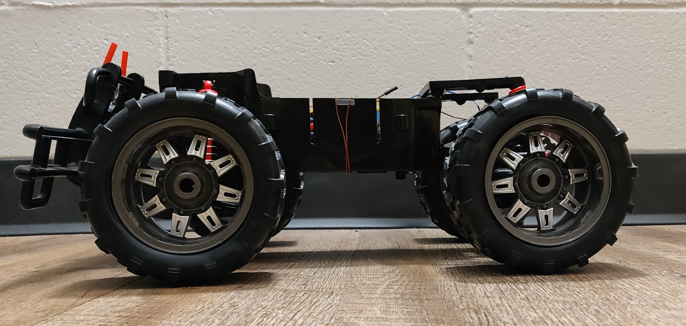

# Autonomous-RC-Car
This project demonstrates building an autonomous RC car.
# The front view of my RC car.

 # The side view of my RC car.
 

# I am tweaking the existing Radio Controlled Car to be an autonomously driven car.
<h2> The materials required for this project are as follows.</h2>

1. RC Car
2. Ultrasonic Sensor.
3. Ada-fruit Motor Shield L239D.
4. Servo.
5. LCD. 
6. LED for the brake lights.
7. Massive amount of batteries.

<h3> Contributors </h3>
I am the only contributor for this project. My name is Tanu Nanda Prabhu, I am fascinated about cars, also I am a car freak, Hence I chose this project which makes me happy. Contact me at @ tanuprabhu96@gmail.com

<h3>NOTE: Don't Copy or else I'll grab your cookies.</h3>
