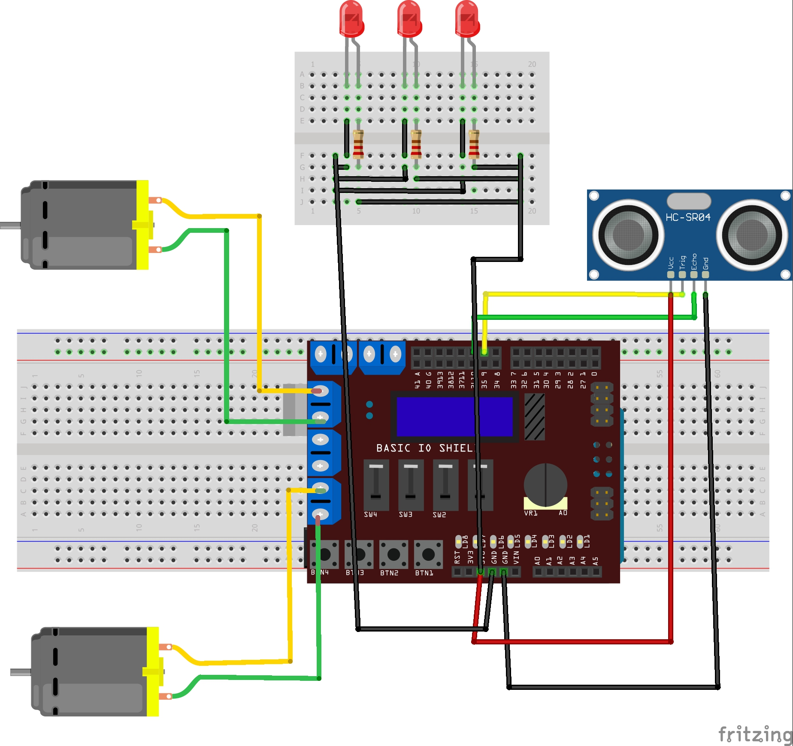
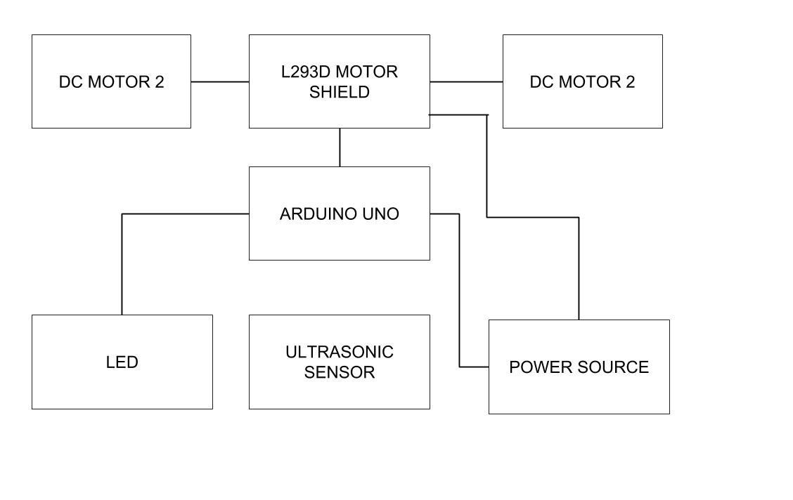

# Autonomous-RC-Car
This project demonstrates building an autonomous RC car.
<h2>The front view of my RC car</h2>

<h2> The side view of my RC car</h2>
 
 
 # Build Instructions
 
 The breadboard view gives you a strong clarity of how different components are connected together, by looking at this you can aslo build similar design for your project.
 
 

# I am tweaking the existing Radio Controlled Car to be an autonomously driven car.
# Repository Contents
__Here's where you'll provide a map of all the top-level contents (where applicable):__
1. __/src__ - This is where you can see all the coding stuff (.ino).
2. __/hardware__ - You can see all  the PCB design files here (.ftz, .brd, .sch, .stl).
3. __/libraries__ - This is the place where you can see the relevant library of the project.
4. __/Images__ - This is where the image files for this readme are..
5. __/Modules__ - This is the place where the code is divided into segments, for better understanding.
6. __/README.md__ - The file you're reading now! :-D

# Block Diagram

Here is the block diagram of this project which depicts all the components connected together. With the help of this the user can understand the connection of the components.

 

# Requirements and Materials
<h4> Libraries required for the project are </h4>
 <b>1. ADAFRUIT MOTOR-SHIELD LIBRARY</b> : (https://github.com/adafruit/Adafruit-Motor-Shield-library/zipball/master)

<h4> The materials required for this project are as follows.</h2>

1. 1 x RC Car
2. 1 x Ultrasonic Sensor.
3. 1 x Ada-fruit Motor Shield L239D. 
4. 3 x LED for the brake lights.
5. 2 x Battery holders.
6. 2 x Bread board for placement of Arduino Uno and Ultrasonic sensor.
7  3 x 100k resistor
8. 10 x AA Massive amount of batteries (10 Volts).
9. 1 x Push-Button if needed.
<h3> Installing Arduino Software </h3>
1. You can download the IDE from here : (https://www.arduino.cc/en/main/software).
2. After you install the IDE click here to learn more about it : (https://www.arduino.cc/en/Guide/HomePage).

<h3> Usage </h3>

1). Upload the code to the Arduino.
2). Power both the Arduino and the Motor-shield via batteries.
3). Then the car moves to the front automatically, it then stops if it finds an obstacle, and then goes back for a bit, and then turns to the left and again checks for the obstacle, otherwise, it turns to the right this time and further continues to go in the same       direction.
4). This would be cool to watch because it automatically does all these things by itself.
5). Last, don’t forget to remove the batteries from the battery holder, sometimes both the Arduino and the Motor-Shield can become really hot after an immense usage.

<h3> Contributors </h3>
1. <b>Tanu Nanda Prabhu</b> - I did everything. I am the only contributor for this project, I am fascinated about cars, also I am a car freak, Hence I chose this project which makes me happy. Contact me at @ tanuprabhu96@gmail.com

<h3>Update: The battery problem is somehow solved !!!!, Next part is to control the steering accordingly.</h3>

<h3>NOTE: Don't Copy or else I'll grab your cookies.</h3>

